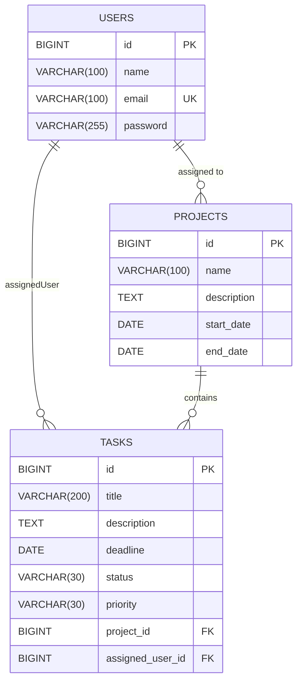

# Task Management System

A full-stack Task Management System built with Spring Boot 3, Spring Security (JWT), SQL Server, and ReactJS.
Features a responsive, premium user interface with a Kanban-style Task Board.

## Tech Stack
- **Backend:** Java 21, Spring Boot 3.2.5, Spring Security, JWT, Lombok, Swagger.
- **Database:** Microsoft SQL Server.
- **Frontend:** ReactJS (Vite), Axios, React Router.

## Entity Relationship Diagram (ERD)


## API Documentation
Once the backend is running, you can view the complete interactive API documentation via Swagger UI:
- **Swagger URL:** `http://localhost:8080/swagger-ui/index.html`
*(Note: Use the "Authorize" button to inject your JWT token for protected endpoints)*

## Installation & Setup

### 1. Database Setup
Ensure you have **Microsoft SQL Server** running. The application expects integrated security (Windows Auth) by default or standard credentials if you modify the properties. It will automatically create/update the `task_management` database schema.

### 2. Role & Admin Account
Public registration always creates a normal `USER` account. Admin accounts are not created from the public Register form.

On application startup, the backend seeds one initial admin account from environment variables:

```properties
ADMIN_SEED_ENABLED=true
ADMIN_NAME=System Admin
ADMIN_EMAIL=admin@example.com
ADMIN_PASSWORD=Admin@12345
```

For production or deployment, override `ADMIN_EMAIL` and `ADMIN_PASSWORD` in the hosting environment.

Role behavior:
- `ADMIN`: create projects, create/assign tasks, view team members, monitor all tasks.
- `USER`: view assigned tasks and update task status only.

### 3. Backend
```bash
cd Task-Management-System
# Run using Maven wrapper
./mvnw spring-boot:run
```

### 4. Frontend
```bash
cd Task-Management-System/frontend
npm install
npm run dev
```

### 5. Usage
- Open `http://localhost:5173` in your browser.
- Login with the seeded admin account to create projects and assign tasks.
- Register a normal user account to view and update assigned work.
